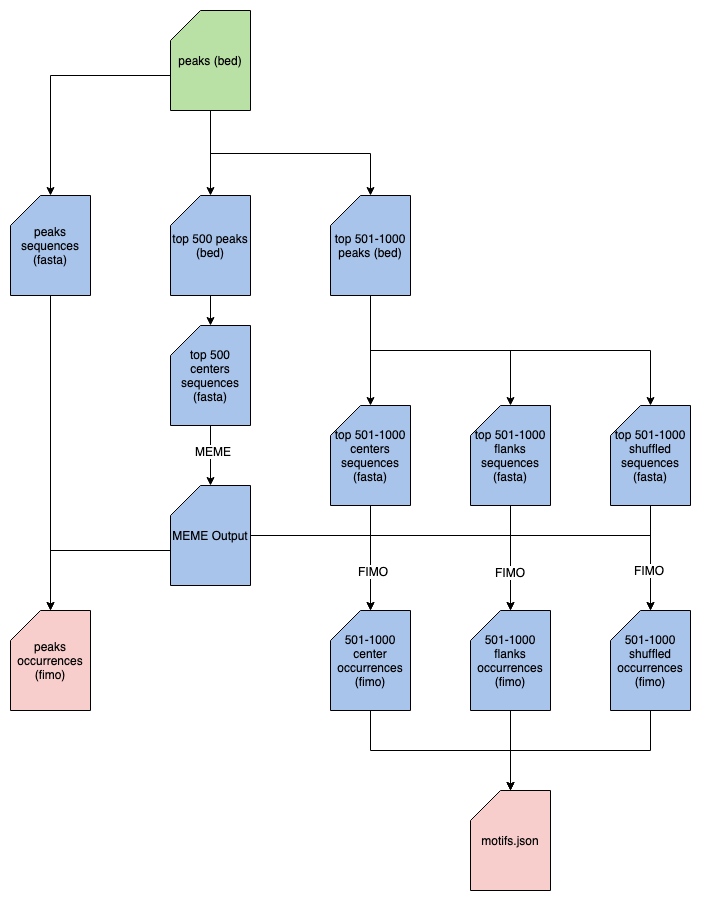

# Factorbook Meme

A Dockerized application used by Factorbook workflows to find motifs and motif occurrences using MEME suite

## Running

The built docker container can be found on docker hub as genomealmanac/factorbook-meme.

To run make sure the files you pass are accessible within the container and run the container with the command 
followed by the arguments you need:

`java -jar /app/meme.jar`

### Arguments

| Name |  Description |  Required | Default |
|---|---|---|---|
| `--peaks` | path to peaks in narrowPeak format | yes | |
| `--twobit` | path to two-bit file for this assembly | yes | |
| `--chrom-info` | path to chromosome lengths for this assembly | yes | |
| `--offset` | Offset, in bp, to shift peaks |  no | 0 |
| `--output-dir` | Path to write output files | yes | |
| `--methyl-bed` | Path to optional methylation state @CpG bed file | no | |
| `--methyl-percent-threshold` | Percentage over which we will use a methylation site from the methylation bed file | no | |

Here's how a complete command with arguments should look:

`java -jar /app/meme.jar --peaks=/data/in/my-peaks.bed --twobit=/data/in/my-twobit.2bit 
--chrom-info=/data/in/my-chrominfo.sizes --output-dir=/data/out`

## Procedure



*Some files and steps are omitted for brevity

### Procedure with Methylation States @CpG


## File Inputs and Outputs

See `src/test/resources` for a complete example set of input and output files

### Chrom Info Files (Input)

The required chrom info file is a tab delimited file containing chromosome names and lengths in bp. For example:

```
chr1	1000000
chr2	2000000
```

### motifs.json

One of the main outputs of Factorbook MEME is a json file describing the top 5 motifs found in the top 500 peaks, 
each with the following quality measurements

```json
  "lesser_peaks_occurrences_ratio": 0.016260162601626018,
  "flank_control_data": {
    "occurrences_ratio": 0.05420054200542006,
    "z_scores": -2.9818118487600063,
    "p_value": 0.0014327402228297426
  },
  "shuffled_control_data": {
    "occurrences_ratio": 0.146,
    "z_scores": -6.779866983128997,
    "p_value": 6.014355680150629E-12
  }
```

- `occurrences_ratio` refers to the ratios of motif occurrences to total sequences they were pulled from. 
    - The base level `lesser_peaks_occurrences_ratio` comes from the 500-1k centered sequences fimo run. 
    - The `occurrences_ratio` values in `flank_control_data` and `shuffled_control_data` come from the 500-1k flanks and shuffled fimo runs.
- `zscore` and `pvalue` come from comparing control data `occurrences_ratio` to our base level `occurrences_ratio`.
    - Higher values mean our motifs occur more frequently in our 501-1k center sequences than our controls.

## For Contributors

The scripts/ directory contains utilities you can use to build, test, and deploy

### Building

To build the docker container with a tag, use `scripts/build-image.sh`.

### Testing

To test using and IDE, run `scripts/run-dependenies.sh` first, then run tests manually in IDE. When 
finished, run `scripts/stop-dependencies.sh`.

To test from command line, use `scripts/test.sh`. This just runs run-dependencies.sh, 
runs tests using gradle, then stop-dependencies.sh.

`scripts/run-dependenies.sh` spins up a docker container with all application dependencies like the 
Meme Suite installed. Our tests run these applications using `docker exec`.

### Deploy

To deploy the image to our docker repository, use `scripts/push-image.sh`.